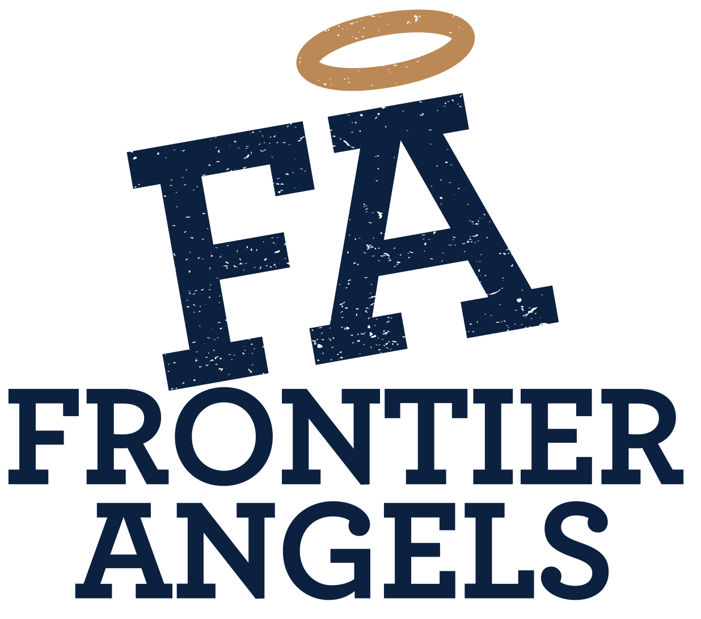

Read this file fully before making any style changes. Apply the design system precisely — do not invent new colors, fonts, or patterns.

---

## BRAND OVERVIEW

**Frontier Angels** is an angel investor network that backs early-stage founders. They operate investment funds (Fund 4, Fund 5). The brand is authoritative, community-driven, and aspirational — serious but not corporate.

---

## COLOR SYSTEM

Two brand colors + white. Do not introduce others.

```css
/* ── Brand Primaries ── */
--navy-900: #0C2140;   /* PRIMARY — logo, headings, buttons, dark bg */
--gold-600: #BB8956;   /* ACCENT — halo icon, CTAs, highlights */

/* ── Navy Scale ── */
--navy-950: #060f1e;
--navy-800: #112c55;
--navy-700: #163769;
--navy-600: #1d4a88;
--navy-500: #255da5;
--navy-400: #4f7fbf;
--navy-300: #80a5d2;
--navy-200: #b4cae6;
--navy-100: #d9e6f3;
--navy-50:  #edf4fb;

/* ── Gold Scale ── */
--gold-700: #9a6425;
--gold-500: #c99970;
--gold-300: #e3c4ae;
--gold-100: #f7ede3;
--gold-50:  #fdf6f0;

/* ── Neutral Scale ── */
--neutral-900: #1a1a1a;
--neutral-700: #454545;
--neutral-500: #787878;
--neutral-300: #b5b5b5;
--neutral-100: #ebebeb;
--neutral-50:  #f7f7f7;

/* ── Semantic Aliases ── */
--color-brand-primary:   #0C2140;
--color-brand-accent:    #BB8956;
--color-bg-page:         #ffffff;
--color-bg-subtle:       #edf4fb;
--color-bg-dark:         #0C2140;
--color-text-primary:    #0C2140;
--color-text-secondary:  #163769;
--color-text-muted:      #4f7fbf;
--color-text-on-dark:    #ffffff;
--color-text-accent:     #BB8956;
--color-text-link:       #1d4a88;
--color-text-link-hover: #BB8956;
--color-border:          #d9e6f3;
--color-border-strong:   #80a5d2;
--color-focus-ring:      #BB8956;
```

**Usage rules:**
- Dark sections/heroes: `background: #0C2140`, `color: #ffffff`
- Gold is accent only — CTAs, highlights, the halo. Not for large fills.
- Never use pure black `#000` for text — always use `#0C2140` (navy).
- Light tint background: `#edf4fb` (navy-50)

---

## TYPOGRAPHY

```css
/* Families */
--font-display: 'Bitter', Georgia, serif;        /* headings, bold slab serif */
--font-body:    'Source Sans 3', system-ui, sans-serif;  /* body, UI */
--font-mono:    'Source Code Pro', monospace;    /* numbers, code */

/* Google Fonts import */
@import url('https://fonts.googleapis.com/css2?family=Bitter:wght@400;600;700;800;900&family=Source+Sans+3:wght@300;400;500;600;700&family=Source+Code+Pro:wght@400;500&display=swap');
```

**Heading styles:**
```css
h1 { font-family: 'Bitter', serif; font-weight: 800; font-size: clamp(2.5rem, 5vw, 4rem); line-height: 1.1; color: #0C2140; letter-spacing: -0.01em; }
h2 { font-family: 'Bitter', serif; font-weight: 700; font-size: clamp(1.75rem, 3vw, 2.5rem); line-height: 1.2; color: #0C2140; }
h3 { font-family: 'Bitter', serif; font-weight: 700; font-size: 1.5rem; line-height: 1.3; color: #0C2140; }
h4 { font-family: 'Bitter', serif; font-weight: 600; font-size: 1.125rem; color: #0C2140; }
p  { font-family: 'Source Sans 3', sans-serif; font-size: 1rem; line-height: 1.65; color: #163769; }
```

**Eyebrow / overline labels:**
```css
.eyebrow {
  font-family: 'Source Sans 3', sans-serif;
  font-size: 11px; font-weight: 700;
  letter-spacing: 0.12em; text-transform: uppercase;
  color: #BB8956;
}
```

**On dark backgrounds:**
```css
/* headings → white, body → rgba(255,255,255,0.75), eyebrow → #BB8956 */
```

---

## SPACING

4px base grid.

```css
--space-1:  4px;   --space-2:  8px;   --space-3:  12px;
--space-4:  16px;  --space-5:  20px;  --space-6:  24px;
--space-8:  32px;  --space-10: 40px;  --space-12: 48px;
--space-16: 64px;  --space-20: 80px;  --space-24: 96px;
```

Standard card padding: `24px`. Section vertical padding: `64–96px`.

---

## BORDER RADIUS

```css
--radius-sm:   4px;   /* buttons, inputs */
--radius-md:   6px;
--radius-lg:   10px;  /* cards */
--radius-xl:   16px;  /* modals */
--radius-full: 9999px; /* pills, avatars */
```

No aggressive rounding. Cards: `border-radius: 10px`. Buttons: `border-radius: 4px`.

---

## SHADOWS

```css
--shadow-sm:   0 1px 3px rgba(12,33,64,0.10), 0 1px 2px rgba(12,33,64,0.06);
--shadow-md:   0 4px 6px rgba(12,33,64,0.08), 0 2px 4px rgba(12,33,64,0.06);
--shadow-lg:   0 10px 15px rgba(12,33,64,0.08), 0 4px 6px rgba(12,33,64,0.05);
--shadow-gold: 0 0 0 3px rgba(187,137,86,0.30);   /* featured/accent */
--shadow-focus: 0 0 0 3px rgba(187,137,86,0.50);  /* focus rings */
```

Shadow color is always navy-tinted, never black.

---

## COMPONENTS

### Button

```html
<!-- Primary (navy fill) -->
<button class="btn btn-primary">Invest Now</button>

<!-- Accent (gold fill) -->
<button class="btn btn-accent">Apply for Fund 5</button>

<!-- Secondary (outlined) -->
<button class="btn btn-secondary">Learn More</button>
```

```css
.btn {
  display: inline-flex; align-items: center; gap: 8px;
  padding: 11px 22px;
  font-family: 'Source Sans 3', sans-serif;
  font-size: 13px; font-weight: 600;
  letter-spacing: 0.06em; text-transform: uppercase;
  border-radius: 4px; border: 2px solid transparent;
  cursor: pointer; transition: all 160ms ease;
}
.btn-primary   { background: #0C2140; color: #fff; border-color: #0C2140; }
.btn-primary:hover { background: #112c55; border-color: #112c55; }
.btn-accent    { background: #BB8956; color: #fff; border-color: #BB8956; }
.btn-accent:hover  { background: #9a6425; border-color: #9a6425; }
.btn-secondary { background: transparent; color: #0C2140; border-color: #0C2140; }
.btn-secondary:hover { background: #edf4fb; }
.btn:focus-visible { outline: none; box-shadow: 0 0 0 3px rgba(187,137,86,0.50); }
.btn:active    { transform: scale(0.97); }
```

### Card

```css
.card {
  background: #fff;
  border: 1px solid #d9e6f3;
  border-radius: 10px;
  padding: 24px;
  box-shadow: 0 4px 6px rgba(12,33,64,0.08);
  transition: box-shadow 160ms ease, transform 160ms ease;
}
.card:hover {
  box-shadow: 0 20px 25px rgba(12,33,64,0.10);
  transform: translateY(-2px);
}
.card-navy  { background: #0C2140; color: #fff; border: none; }
.card-featured { border: 2px solid #BB8956; box-shadow: 0 0 0 3px rgba(187,137,86,0.30); }
```

### Badge

```css
.badge {
  display: inline-flex; align-items: center; gap: 5px;
  padding: 4px 9px;
  font-family: 'Source Sans 3', sans-serif;
  font-size: 10px; font-weight: 700;
  letter-spacing: 0.10em; text-transform: uppercase;
  border-radius: 2px;
}
.badge-navy        { background: #0C2140; color: #fff; }
.badge-gold        { background: #BB8956; color: #fff; }
.badge-navy-subtle { background: #d9e6f3; color: #163769; }
.badge-gold-subtle { background: #f7ede3; color: #7a4e18; }
.badge-success     { background: #e6f4ed; color: #1e6b41; }
.badge-outline     { background: transparent; color: #0C2140; border: 1px solid #80a5d2; }
```

---

## LOGO ASSETS

Logos are in `assets/logos/` relative to the design system root.

| File | Use |
|---|---|
| `assets/logos/logo-full-color.png` | Light backgrounds — primary use |
| `assets/logos/logo-full-color.svg` | Light backgrounds — scalable |
| `assets/logos/logo-no-texture.svg` | Clean version, no distress |
| `assets/logos/logo-fa-only.png` | FA mark, no wordmark (favicons, small spots) |
| `assets/logos/logo-type-only.svg` | Wordmark only |
| `assets/logos/logo-white.png` | Dark backgrounds (apply CSS `filter: brightness(10)`) |
| `assets/logos/variants/variant-3.png` | Horizontal layout |
| `assets/logos/variants/variant-4.png` | Horizontal layout (alt) |

**Logo on dark background:**
```html

```

---

## VOICE & COPY RULES

- **Brand name:** Always "Frontier Angels" (capitalized, two words). Never just "FA" in copy.
- **Fund names:** "Fund 5", "Fund 4" (capitalize Fund).
- **Tone:** Direct, confident, community-first. No hype. No emoji in professional contexts.
- **Casing:** Title Case for nav/section headers. Sentence case for body. ALL CAPS for badges/buttons.
- **Person:** "We invest…" / "Our portfolio…" for brand. "Apply today" / "You'll get…" for CTAs.
- **No pure black text** — use `#0C2140` (navy).

---

## VISUAL DO's AND DON'Ts

✅ Navy `#0C2140` as primary dark color  
✅ Gold `#BB8956` for accents, CTAs, highlights  
✅ Bitter (bold slab serif) for all headings  
✅ Wide letter-spacing (`0.06–0.12em`) on uppercase labels  
✅ Subtle navy-tinted shadows  
✅ Cards with `border-radius: 10px`  
✅ Gold focus rings  

❌ Gradient backgrounds  
❌ Purple or blue-purple tones  
❌ Rounded corners > 10px on rectangular elements  
❌ Emoji in UI  
❌ Pure black (`#000`) for text  
❌ Heavy drop shadows with black color  
❌ More than 2 background colors in a layout  

---

## HOW TO USE WITH CLAUDE CODE

1. Add this design system folder to your project (or reference it via skill)
2. Tell Claude Code: *"Apply the Frontier Angels design system from [path]/readme.md and SKILL.md to restyle this website"*
3. Claude Code will read these files for colors, fonts, spacing rules, and component patterns
4. To add to a project's `CLAUDE.md`: *"Refer to ./frontier-angels-design-system/SKILL.md for all visual styling decisions"*
